# ARSandbox

Realidad aumentada sobre un cajón de arena que representa mapas topográficos de calor con curvas de nivel en tiempo real, usando un sensor de profundidad Kinect y un proyector de tiro corto.

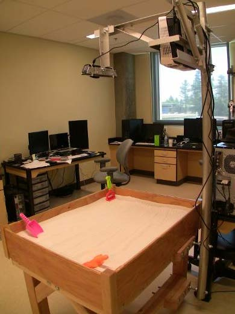
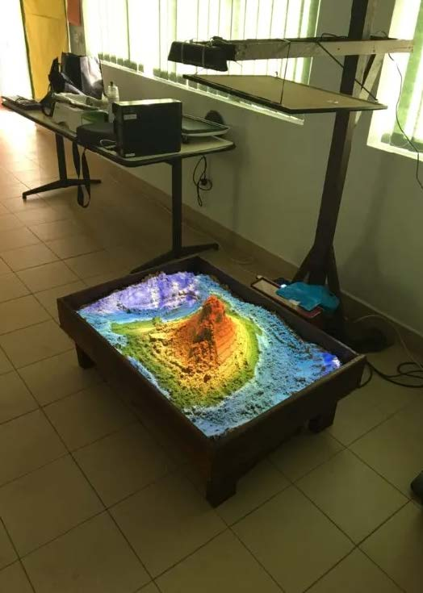
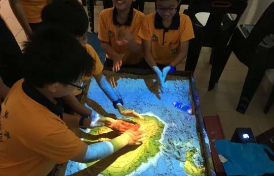
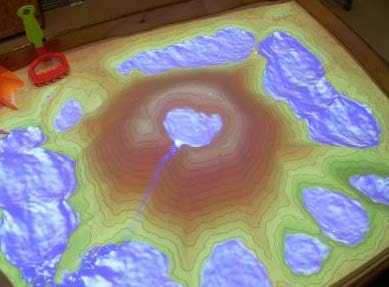

---

## Tabla de contenidos

- [Objetivo](#objetivo)
- [Especificaciones](#especificaciones)
- [Funcionamiento](#funcionamiento)
- [Instalación](#instalación)
  - [Requisitos previos](#requisitos-previos)
  - [Instalación automatizada](#instalación-automatizada)
  - [Pasos de instalación (detalle)](#pasos-de-instalación-detalle)
  - [Calibración](#calibración)
  - [Ejecución y acceso directo](#ejecución-y-acceso-directo)
- [Configuración](#configuración)
- [Galería de construcción](#galería-de-construcción)
- [Enlaces de interés](#enlaces-de-interés)

---

## Objetivo

Representar mapas topográficos de calor con curvas de nivel en tiempo real. Se trata de una realidad aumentada que se proyecta sobre un cajón de arena, representando distintas orografías en función de la superficie de la arena.

Mediante un sensor de profundidad (Kinect) se mide en tiempo real el relieve del arenero, y con un proyector se representa el mapa de calor correspondiente. De este modo, un cúmulo de arena representa una montaña, y un agujero representa una cuenca, río o mar.

Mediante las diferentes funciones del ARSandbox se puede simular la lluvia y acumular agua en las cuencas, ríos, lagos, etc.

Es un proyecto muy vistoso para Ferias de Formación Profesional (FP), ya que combina conocimientos de informática y videojuegos, y también puede resultar útil en la ESO para materias como Geografía.

---

## Especificaciones

| Componente | Detalle |
|---|---|
| **Sistema operativo** | Linux Mint Mate 19.3 o Ubuntu 18.04 |
| **Gráfica** | Nvidia serie 16xxx, 20xxx o 30xxx |
| **Modelo de Kinect** | Preferiblemente el modelo 1473; este montaje usa el 1414 |
| **Proyector** | De tiro corto |
| **Arena** | 50 kg |
| **Tamaño de la caja** | 1 x 0.75 x 0.15 m |
| **Distancia del proyector** | Ideal ~1 m; en este montaje es 0.73 m |

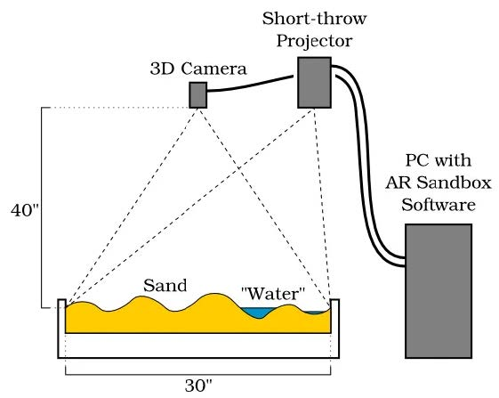

> **Nota:** es importante usar un sistema operativo "antiguo" (Mint 19.x / Ubuntu 18.04), ya que versiones más modernas dan problemas con los repositorios necesarios para compilar Vrui y el Kinect 3D Video Package. Esto, a su vez, limita las gráficas compatibles a las series Nvidia 16xxx/20xxx/30xxx.

---

## Funcionamiento

1. **Encender el proyector primero.** Si el PC se enciende antes que el proyector, en ocasiones no sincroniza correctamente y no reconoce la señal HDMI.
   - Si esto ocurre con el PC ya encendido: desenchufar el cable HDMI del proyector y volver a enchufarlo.
   - La relación de aspecto debe ser **4:3** (valor por defecto).
2. **Encender el PC** e iniciar sesión con las credenciales del equipo.
3. **Hacer doble clic en el icono "ARSandbox"** del escritorio. La aplicación se ejecutará directamente en pantalla completa.
   - Si la pantalla aparece en negro o con líneas verticales de colores, es posible que la Kinect esté mal conectada: revisar el cable USB, cerrar la aplicación con `Esc` y volver a ejecutarla.

### Controles durante la ejecución

| Tecla / Acción | Efecto |
|---|---|
| `1` | Hace llover en todo el mapa |
| `2` | Evapora el agua |
| Mano extendida sobre el terreno | Hace llover en esa zona (cuanto más cerca de la arena, sin confundirse con la altitud, más llueve). Con los dedos separados, la cámara reconoce mejor la mano |
| `Esc` | Finaliza la aplicación (después, apagar el PC) |

### Ajustes adicionales

- **Nivel del agua**: se ajusta en el fichero `BoxLayout.txt` (ver [Calibración](#calibración)), modificando el último valor de la primera línea.
- **Parámetros de la lluvia**: se ajustan en el fichero `SARndbox.cfg` (ver [Configuración](#configuración)).

---

## Instalación

### Requisitos previos

- Un equipo con gráfica Nvidia compatible (serie 16xxx, 20xxx o 30xxx).
- **Linux Mint 19.3 Tricia (MATE)** o **Ubuntu 18.04 LTS** instalado.
  - Versiones más actuales dan problemas, ya que el proceso de instalación depende de repositorios obsoletos.
  - Descarga de Linux Mint 19.1-19.2-19.3 (mate/cinnamon/xfce, 32/64 bits): [Internet Archive – Linux Mint](https://archive.org/details/linuxmint-19.1-19.2-19.3-mate-cinnamon-xfce-32bit-64bit) (subido por Vicente Tinajero Santiago).
- Kinect modelo 1414 o 1473 conectado por USB.
- Proyector de tiro corto conectado por HDMI.

### Instalación automatizada

Este repositorio incluye un script orquestador que ejecuta, paso a paso, todo el proceso de instalación. Cada paso pide confirmación antes de continuar, de forma que puedas revisar o repetir un paso concreto si algo falla (por ejemplo, la calibración).

```bash
git clone <url-del-repositorio>
cd ARSandbox
chmod +x scripts/*.sh
./scripts/install.sh
```

El script `install.sh` llama, en orden, a:

| Script | Qué hace |
|---|---|
| `00_check_requirements.sh` | Comprueba el sistema operativo, la gráfica y los paquetes básicos |
| `01_install_nvidia_driver.sh` | Instala el driver Nvidia adecuado |
| `02_install_vrui.sh` | Descarga y compila Vrui VR Development Toolkit 8.0-002 |
| `03_install_kinect.sh` | Descarga, compila e instala el Kinect 3D Video Package 3.10 |
| `04_install_sarndbox.sh` | Descarga y compila Augmented Reality Sandbox 2.8 |
| `05_setup_shortcuts.sh` | Crea el script de arranque y el icono de escritorio |

> Los pasos de **calibración de la cámara/plano** y **calibración del proyector** son interactivos por naturaleza (requieren mover el ratón, colocar referencias físicas en la caja, etc.), por lo que **no** se automatizan completamente: el script `install.sh` simplemente abre las herramientas correspondientes y muestra en pantalla las instrucciones de la sección [Calibración](#calibración).

### Pasos de instalación (detalle)

A continuación se detalla, de forma manual, lo que hace cada script (útil si prefieres ejecutar los comandos a mano o si algo falla en el script automatizado).

#### 1. Instalar el driver de la gráfica Nvidia

En el "Gestor de controladores" (Driver Manager), elegir:
- **Versión 530** para una Nvidia 3050.
- **Versión 440** para una Nvidia 1650 (recomendado).

Si no se usa una gráfica compatible, el ARSandbox sigue siendo funcional, pero la simulación de lluvia no funcionará correctamente.

Para una 1650, ejecutar primero:

```bash
sudo apt update && sudo apt upgrade -y
# reiniciar el equipo
sudo apt install nvidia-driver-440 nvidia-settings
sudo update-initramfs -u
```

Script equivalente: [`scripts/01_install_nvidia_driver.sh`](scripts/01_install_nvidia_driver.sh)

#### 2. Instalar Vrui VR Development Toolkit 8.0-002

La versión 8.0-001 da problemas al partir del script `.sh`, por lo que se usa la **8.0-002**.

Página de descarga: [Vrui Download](http://web.cs.ucdavis.edu/~okreylos/ResDev/Vrui/Download.html)

```bash
cd ~          # En este equipo, ~ corresponde a /root
wget http://web.cs.ucdavis.edu/~okreylos/ResDev/Vrui/Build-Ubuntu.sh
bash Build-Ubuntu.sh
# Opcional: eliminar el script una vez terminado
rm ~/Build-Ubuntu.sh
```

Para comprobar que la instalación es correcta, se puede ejecutar el programa de ejemplo:

```bash
~/src/Vrui-8.0-002/ExamplePrograms/bin/ShowEarthModel
# o, según el usuario:
/root/src/Vrui-8.0-002/ExamplePrograms/bin/ShowEarthModel
```

Script equivalente: [`scripts/02_install_vrui.sh`](scripts/02_install_vrui.sh)

#### 3. Instalar Kinect 3D Video Package 3.10

Página de descarga: [Kinect Download](https://web.cs.ucdavis.edu/~okreylos/ResDev/Kinect/Download.html)

```bash
cd ~/src
wget http://web.cs.ucdavis.edu/~okreylos/ResDev/Kinect/Kinect-3.10.tar.gz
tar xfz Kinect-3.10.tar.gz
cd Kinect-3.10
make
sudo make install
sudo make installudevrules
ls /usr/local/bin
# Comprobar que aparecen KinectUtil y RawKinectViewer en la salida
```

Si la Kinect es el modelo **1473 o superior** (no es el caso de este montaje, que usa la 1414):

```bash
sudo wget -O /etc/udev/rules.d/70-Kinect.rules \
    https://web.cs.ucdavis.edu/~okreylos/ResDev/Kinect/70-Kinect.rules
sudo udevadm control --reload
sudo udevadm trigger --action=change
```

Script equivalente: [`scripts/03_install_kinect.sh`](scripts/03_install_kinect.sh)

#### 4. Instalar Augmented Reality Sandbox 2.8

Página de descarga: [SARndbox Download](https://web.cs.ucdavis.edu/~okreylos/ResDev/SARndbox/Download.html)

```bash
cd ~/src
wget http://web.cs.ucdavis.edu/~okreylos/ResDev/SARndbox/SARndbox-2.8.tar.gz
tar xfz SARndbox-2.8.tar.gz
cd SARndbox-2.8
make
ls ./bin
# Comprobar que aparecen CalibrateProjector, SARndbox y SARndboxClient en la salida
```

Script equivalente: [`scripts/04_install_sarndbox.sh`](scripts/04_install_sarndbox.sh)

### Calibración

Con la Kinect ya conectada:

#### a) Descargar la calibración de fábrica

```bash
sudo /usr/local/bin/KinectUtil getCalib 0
```

#### b) (Opcional) Calibrar respecto a una pared plana

Tomar entre 5 y 10 medidas a distancias de 0.5 y 1.5 m:

```bash
sudo /usr/local/bin/RawKinectViewer -compress 0
```
- Tecla `A`: captura una foto.
- Tecla `S`: guarda el fichero.

#### c) Alineación entre proyector y Kinect (cámara + plano de la arena)

Referencia completa: [AR Sandbox Calibration (Oliver Kreylos)](https://web.cs.ucdavis.edu/~okreylos/ResDev/SARndbox/Instructions.html)

```bash
cd ~/src/SARndbox-2.8
RawKinectViewer -compress 0
```

Pasos de la calibración:

1. Con la tecla `Z` se puede mover la imagen y hacer zoom para ajustarla al tamaño de la proyección.
2. **Botón derecho > Set Depth Range**: ajusta el color de profundidad.
3. Con la tecla `1` se abre el menú; seleccionando "Extract Equation", la tecla `1` queda asociada a esa función.
4. **Botón derecho > Average Frame**: captura varias imágenes y las promedia, dejando la imagen estática.
5. Colocando el ratón en la esquina superior izquierda de la arena y manteniendo pulsada la tecla `1`, se dibuja el rectángulo que delimita la arena; al soltar, en el terminal aparecen dos ecuaciones de profundidad: la **primera** es del plano de la arena y la **segunda** es la de la cámara (esta última es la que interesa).
6. Se remapea la tecla `2` a "Measure 3D Position". Se toma la posición de las cuatro esquinas de la caja (inferior izquierda, inferior derecha, superior izquierda, superior derecha): se hace clic con cuidado de no mover el cursor y después se pulsa `2`. En el terminal van apareciendo las coordenadas de cada esquina.
7. Se cierra la aplicación.

**Guardado de la calibración**: se almacena la segunda ecuación del plano (vector ortonormal a la superficie) y las cuatro coordenadas de las esquinas. Estas coordenadas se pueden ajustar para recortar la proyección y eliminar los bordes de la caja, editando el fichero:

```bash
xed ~/src/SARndbox-2.8/BoxLayout.txt &
```

#### d) Calibración de la proyección

```bash
cd ~/src/SARndbox-2.8
./bin/CalibrateProjector
```

Pasos de la calibración:

1. Se mapea la tecla `1` a "Capture"; tras mostrar el menú, se asigna la siguiente función a la tecla `2`.
2. La caja debe estar abierta y mostrar una luz roja, que indica que se está capturando la orografía de referencia. Si la luz roja no aparece, pulsar `2` para realizar una captura.
3. Colocar el CD a la altura necesaria para hacer coincidir la cruz proyectada con la del CD, y pulsar `1` cuando la proyección esté en verde.
4. Repetir el proceso varias veces en distintos puntos, hasta volver al primer punto de referencia.
5. Tras tomar varios puntos, modificar el relieve del cajón de arena (hacer hoyos, montículos, etc.) y, sin el CD a la vista, pulsar `2`.
6. Volver a tomar varios puntos de referencia con `1`.

Script de apoyo (abre las herramientas de calibración y muestra estas instrucciones): [`scripts/06_calibration.sh`](scripts/06_calibration.sh)

### Ejecución y acceso directo

#### Ejecución manual

```bash
cd ~/src/SARndbox-2.8
./bin/SARndbox -uhm -fpv
```

- `-uhm`: añade el mapa de color (height map).
- `-fpv`: usa la calibración adicional del proyector.
- `F11`: pantalla completa.
- `Esc`: cierra la aplicación.

#### Script de arranque

```bash
xed ~/src/SARndbox-2.8/RunSARndbox.sh
```

```bash
#!/bin/bash
# Entra en el directorio de SARndbox
cd ~/src/SARndbox-2.8
# Ejecuta SARndbox con los parámetros adecuados
./bin/SARndbox -uhm -fpv
```

```bash
chmod a+x ~/src/SARndbox-2.8/RunSARndbox.sh
```

#### Icono en el escritorio

```bash
xed ~/Escritorio/RunSARndbox.desktop
```

```ini
#!/usr/bin/env xdg-open
[Desktop Entry]
Version=1.0
Type=Application
Terminal=false
Icon=mate-panel-launcher
Icon[en_US]=
Name[en_US]=
Exec=/home/profesor/src/SARndbox-2.8/RunSARndbox.sh
Comment[en_US]=
Name=Start the AR Sandbox
Comment=
```

```bash
chmod a+x ~/Escritorio/RunSARndbox.desktop
```

Script equivalente: [`scripts/05_setup_shortcuts.sh`](scripts/05_setup_shortcuts.sh)

> **Idea adicional**: se puede configurar una segunda pantalla para mostrar el mapa 3D en una vista independiente (no implementado en este montaje).

---

## Configuración

El fichero de configuración de la aplicación se encuentra en:

```bash
xed ~/.config/Vrui-8.0/Applications/SARndbox.cfg
```

Contenido de referencia (ya incluido en [`config/SARndbox.cfg`](config/SARndbox.cfg)):

```ini
section Vrui
    section Desktop
        # Evita que la pantalla se quede en blanco si no se pulsan teclas
        inhibitScreenSaver true
    endsection

    section MouseAdapter
        # Oculta el ratón tras 5 s de inactividad
        mouseIdleTimeout 5.0
    endsection

    section Window
        # Fuerza la ventana de la aplicación a pantalla completa
        windowFullscreen true
    endsection

    section Tools
        section DefaultTools
            # Tecla 1 - Llueve, Tecla 2 - Drena
            section WaterTool
                toolClass GlobalWaterTool
                bindings ((Mouse, 1, 2))
            endsection
        endsection
    endsection
endsection

section SARndbox
    # Intensidad de la lluvia
    rainStrength 0.7
    # Velocidad del agua
    waterSpeed 1.2
    # Velocidad de evaporación
    evaporationRate 0.003
endsection
```

### Ajustes rápidos

| Parámetro | Fichero | Descripción |
|---|---|---|
| Nivel del agua | `BoxLayout.txt` (último valor de la primera línea) | Define la altura base del agua respecto al plano de la arena |
| `rainStrength` | `SARndbox.cfg` | Intensidad de la lluvia |
| `waterSpeed` | `SARndbox.cfg` | Velocidad de propagación del agua |
| `evaporationRate` | `SARndbox.cfg` | Velocidad de evaporación del agua |

---

## Galería de construcción

Fotografías del montaje físico (estructura, Kinect, proyector, cajón de arena y proyecciones de prueba):

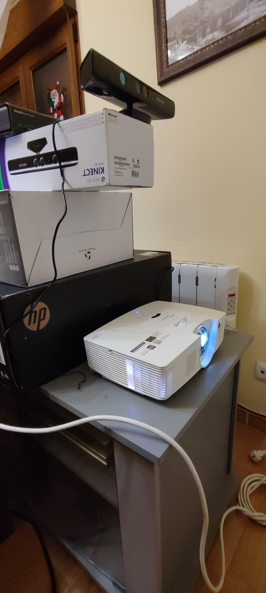
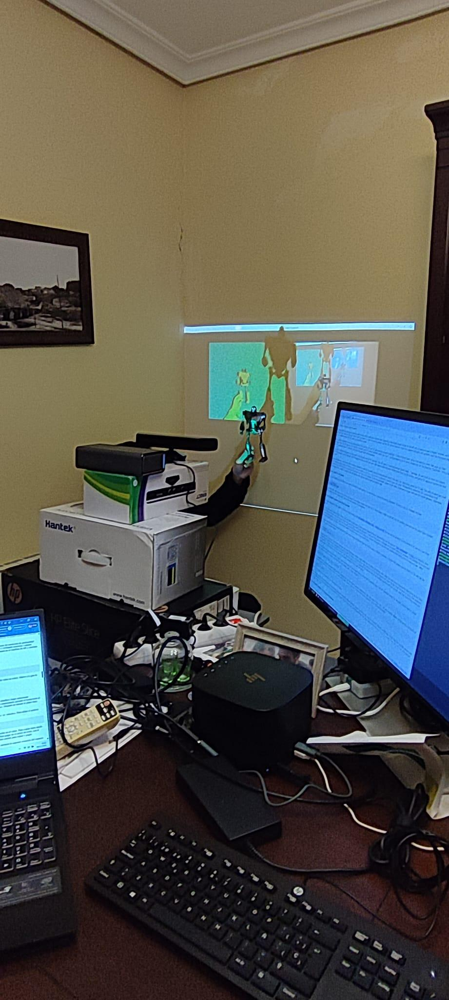
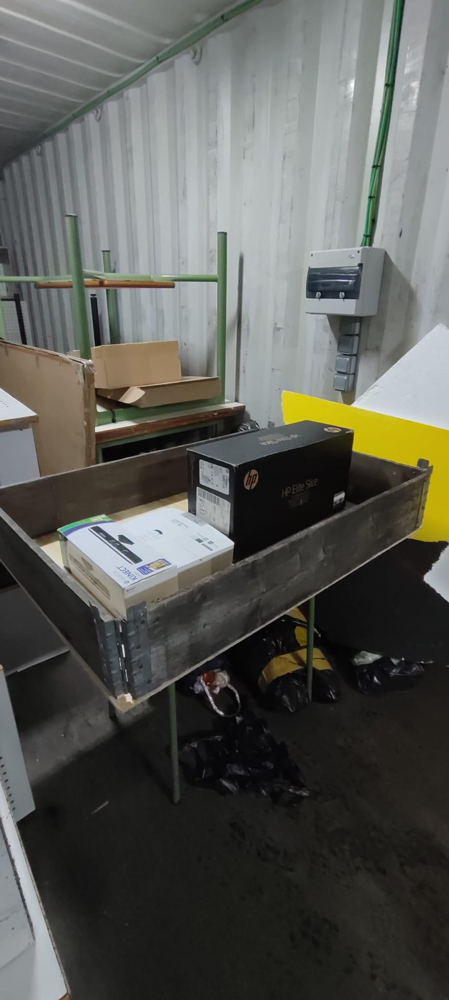
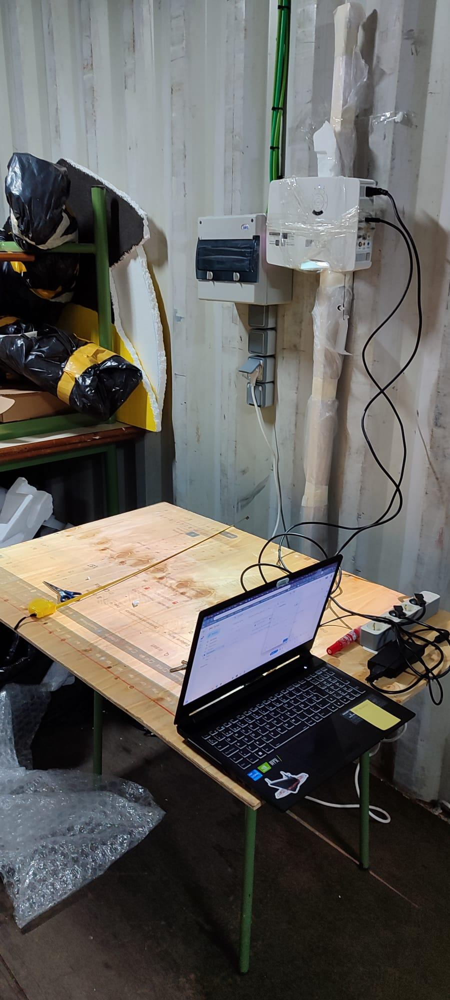
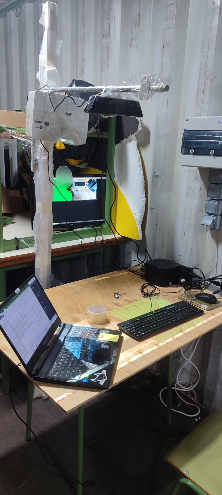
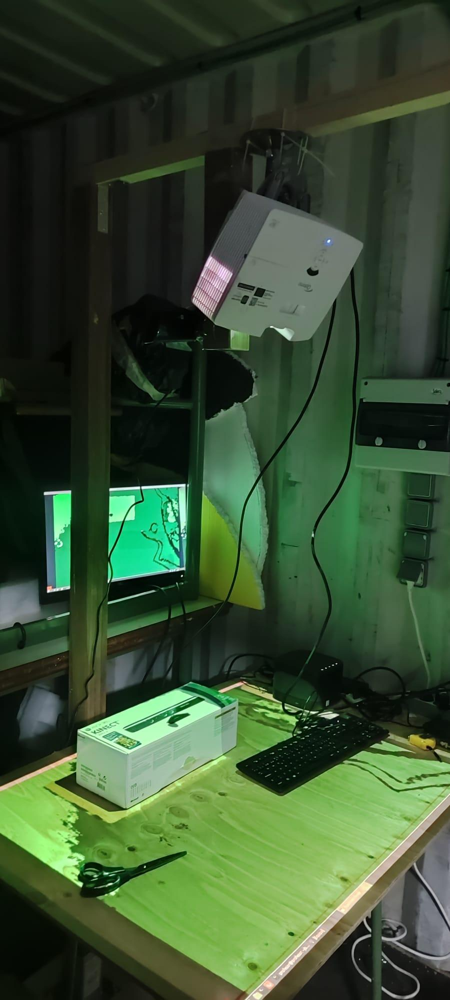
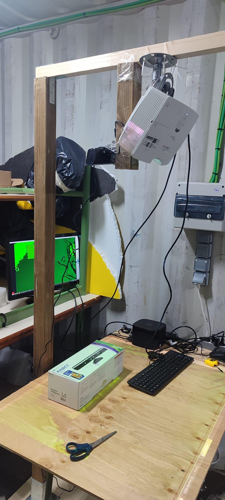
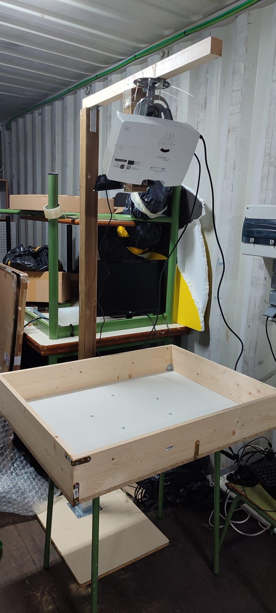
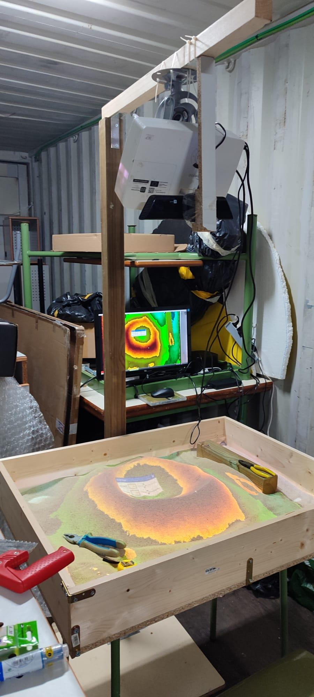
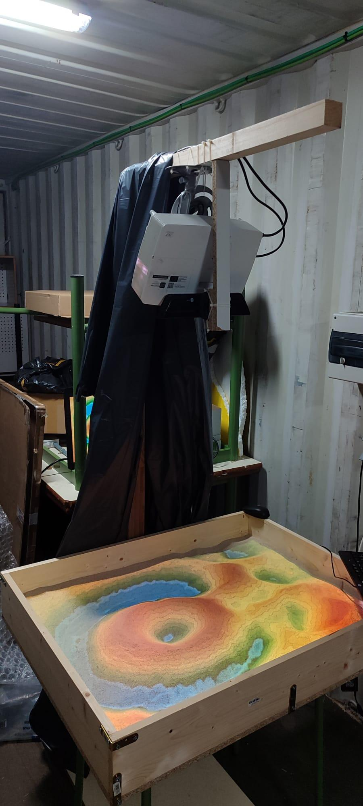
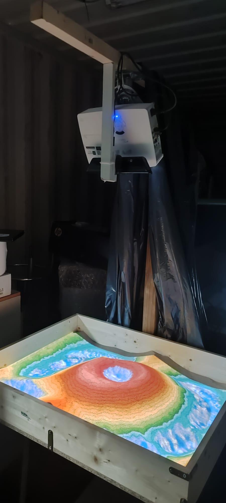

Vídeo de demostración: `ARSandbox.mp4` (no incluido en este repositorio por tamaño; añadir manualmente en `docs/` si se desea).

---

## Enlaces de interés

- Guía en español (simplificada): [Realidad Aumentada — Construyendo un ARSandbox](https://web.cs.ucdavis.edu/~okreylos/ResDev/SARndbox/)
- Fuente original (inglés): [Oliver Kreylos – Augmented Reality Sandbox](https://web.cs.ucdavis.edu/~okreylos/ResDev/SARndbox/)
- Guía de instalación de Vrui: [InstallationGuide.html](http://web.cs.ucdavis.edu/~okreylos/ResDev/Vrui/InstallationGuide.html)
- Requisitos de SARndbox: [Instructions.html](https://web.cs.ucdavis.edu/~okreylos/ResDev/SARndbox/Instructions.html)
- Preguntas frecuentes: [FAQ.html](https://web.cs.ucdavis.edu/~okreylos/ResDev/SARndbox/FAQ.html)

---

## Licencia

Documenta este proyecto según convenga (por ejemplo, MIT, GPL, o uso interno educativo). Añadir un fichero `LICENSE` si se va a publicar públicamente.
